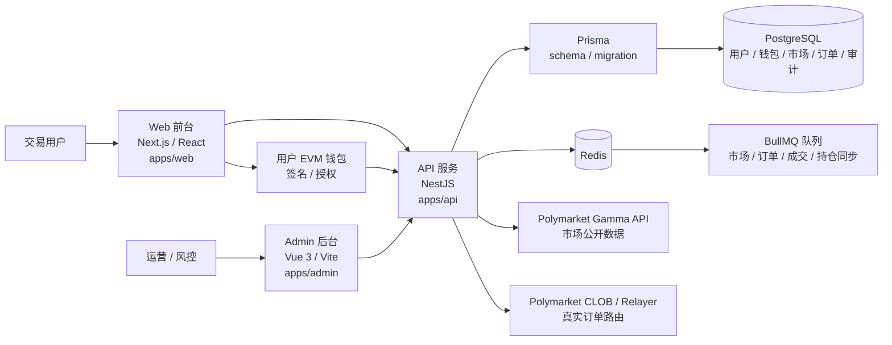

# PMX Polymarket 交易工作台

PMX 是一个非托管的 Polymarket 第三方交易工作台。当前目标是搭建可验证的交易准备链路：用户注册、登录、市场浏览、钱包绑定、Deposit Wallet、订单预览、用户签名、API 校验，以及后续 CLOB 路由和状态同步。

平台不托管用户资金，不保存用户私钥。真实 CLOB 下单默认未启用，启用前需要人工确认 relayer、权限、地区限制、市场范围和金额上限。

## 架构图



## 技术栈

| 模块 | 技术 | 路径 |
|---|---|---|
| Web 前台 | Next.js、React、Vitest | `apps/web` |
| Admin 后台 | Vue 3、Vite、Pinia、Vue Router、Ant Design Vue | `apps/admin` |
| API 后端 | NestJS、Prisma、BullMQ、Jest | `apps/api` |
| 共享包 | TypeScript 类型、阶段、人工 Gate 常量 | `packages/shared` |
| 数据库 | PostgreSQL | `apps/api/prisma` |
| 队列与缓存 | Redis、BullMQ | `apps/api/src/jobs` |
| E2E | Playwright | `tests/e2e` |

## 目录说明

| 路径 | 说明 |
|---|---|
| `apps/web` | 面向交易用户的前台，包含市场、账户、钱包和订单相关页面 |
| `apps/admin` | 面向运营和风控的后台，包含登录、Dashboard、用户管理等页面 |
| `apps/api` | 后端 API，负责认证、权限、市场数据代理、订单校验、钱包状态和审计 |
| `packages/shared` | 前后端共享的类型和业务阶段常量 |
| `docs` | 架构、开发计划、本地开发和验收说明 |
| `tests/e2e` | Playwright 浏览器端验收测试 |

## 本地启动

要求 Node.js `>=20.11`，Admin 子项目要求 Node.js `>=20.19.0`。

```bash
cp .env.example .env
docker compose up -d
npm install
npm run prisma:generate
npm run db:migrate
npm run db:seed
npm run dev
```

启动后访问：

| 服务 | 地址 |
|---|---|
| Web | `http://localhost:3000` |
| Admin | `http://localhost:3001/#/login` |
| API Health | `http://localhost:4000/health` |

默认管理员账号：

| 字段 | 值 |
|---|---|
| Email | `admin@pmx.local` |
| Password | `change-me-123` |

## 常用命令

```bash
npm run dev
npm run build
npm test
npm run test:e2e
npm run lint
```

单独启动某一端：

```bash
npm run start:dev --workspace @pmx/api
npm run dev --workspace @pmx/web
npm run dev --workspace @pmx/admin
```

## 核心数据流

1. Web 通过 API 读取市场、账户、钱包、订单和持仓状态。
2. API 通过 Prisma 读写 PostgreSQL。
3. Redis 和 BullMQ 用于异步同步和后续限流。
4. 市场数据默认读取 Polymarket Gamma API，只做展示和同步。
5. 用户通过自己的 EVM 钱包完成签名和授权。
6. 订单预览只返回校验结果、风险提示和待签名摘要，不直接提交 CLOB。
7. 用户签名后，API 校验签名和订单摘要，再按配置路由到 CLOB 或保持 preview 模式。
8. Admin 只读取运营和风控数据，不参与用户签名和资金控制。

## 当前边界

| 项目 | 状态 |
|---|---|
| 资金托管 | 平台不托管用户资金 |
| 私钥 | 平台不接触、不保存用户私钥 |
| 市场数据 | 已接入 Polymarket Gamma API，只读 |
| 真实交易 | 默认 `ORDER_ROUTER_MODE=preview`，真实 CLOB 提交未启用 |
| 人工 Gate | relayer 权限、Deposit Wallet、geoblock、真实交易范围都需要上线前确认 |
| Admin | 当前是按 Vben v5 技术方向建设的精简后台，不是完整官方 Vben v5 monorepo |

## 验证

本地验收命令：

```bash
npm run build
npm test
npm run test:e2e
```

通过标准：

- Web、Admin、API、Shared 都能构建。
- API 和 Web 单元测试通过。
- Playwright 主流程通过。
- 普通用户不能进入 Admin。
- 管理员能进入 Admin 并看到真实用户数据。

更多说明见：

- `docs/architecture.md`
- `docs/local-development.md`
- `docs/development-plan.md`
