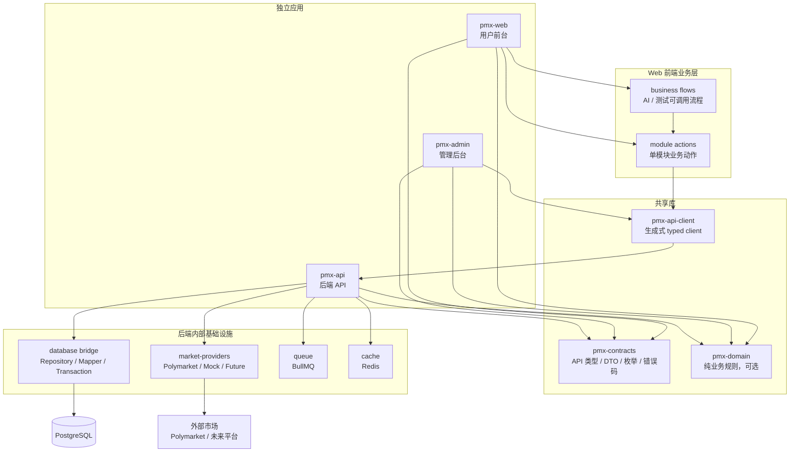

# PMX V2 重构方案索引

V2 的目标不是换业务方向，而是把当前项目整理成更清楚、更低耦合、更依赖成熟开源工具的工程结构。

核心结论：

- 保留 `Next.js + React`、`Vue 3 + Vite`、`NestJS`、`Prisma`、`BullMQ`。
- 用 `Nx` 管理多项目和模块边界，暂时不拆成多个 Git 仓库。
- Web、Admin、API 作为独立应用项目。
- API 契约、公共枚举、错误码、生成客户端作为共享库。
- 数据库桥接层只给后端使用。
- Polymarket 对接封装成 Provider，后续可以换平台。
- 钱包、Deposit Wallet、余额、Funding 拆成独立模块。
- Web 增加 Business Flow Layer，让 AI 和测试直接调用完整业务流程，Playwright 只做少量 UI smoke。

## 文档列表

| 文件 | 内容 |
|---|---|
| `01-architecture-decision.md` | V2 架构决策、方案取舍、总体关系图 |
| `02-target-project-structure.md` | 目标目录结构、项目依赖规则、模块边界 |
| `03-shared-contracts-and-api-client.md` | 三端共享契约、OpenAPI、前端 API client 与业务 flow 的关系 |
| `04-web-modules.md` | 用户前台模块拆分、actions/flows/scenarios 封装 |
| `05-admin-modules.md` | 管理后台模块拆分 |
| `06-api-modules.md` | 后端 API 模块拆分 |
| `07-database-bridge.md` | 数据库桥接层、Repository、Mapper、Transaction |
| `08-market-provider-adapter.md` | Polymarket 和未来 Provider 适配层 |
| `09-wallet-balance-funding.md` | 钱包、余额、Deposit Wallet、Funding 的独立关系 |
| `10-open-source-tooling.md` | 尽量少自研、多用开源工具的方案 |
| `11-migration-and-validation.md` | 迁移步骤、flow 测试验收标准、风险控制 |

## 总体模块图

## 建议阅读顺序

1. 先看 `01-architecture-decision.md`。
2. 再看 `02-target-project-structure.md`。
3. 如果关注三端复用，看 `03-shared-contracts-and-api-client.md`。
4. 如果关注业务拆分，看 `04` 到 `09`。
5. 如果要真正开始迁移，看 `10` 和 `11`。
