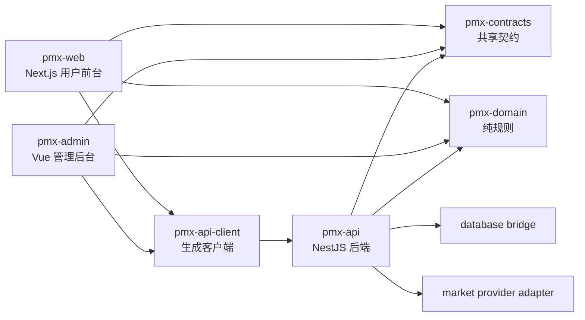

# V2 架构决策

## 目标

V2 要解决的问题：

- 前台、后台、后端边界不够清楚。
- API 类型、状态、错误码容易在三端重复维护。
- 数据库查询和业务逻辑容易混在一起。
- Polymarket 细节不应该进入核心业务。
- 钱包、余额、Deposit Wallet、Funding 需要拆开。
- 后续希望尽量少写自研工程代码，多用成熟开源工具组织项目。

## 推荐方案

推荐采用 **Nx 单仓多项目**：

```text
一个 Git 仓库
多个独立应用项目
多个共享库项目
统一依赖边界和任务编排
```

这不是继续把所有东西混在一起。它的重点是：**同仓管理，不同项目独立构建、独立测试、独立部署。**

## 方案对比

| 方案 | 优点 | 缺点 | 推荐 |
|---|---|---|---|
| Nx 单仓多项目 | 项目图、缓存、依赖边界、生成器、CI 友好 | 比纯 npm workspaces 重一点 | 推荐 |
| Turborepo 单仓多项目 | 轻，任务缓存简单 | 模块边界约束弱，需要自己补规则 | 次选 |
| 多 Git 仓库 | 权限和发布边界最清楚 | 契约同步、联调、版本管理成本高 | 暂不推荐 |
| 继续现有结构 | 成本最低 | 模块边界仍然弱 | 不推荐 |

## 为什么暂时不拆多仓

当前业务还在快速变化阶段。多仓会立刻带来这些成本：

- `contracts` 需要发包或用私有 registry。
- API client 生成和版本同步变复杂。
- 本地联调需要同时拉多个仓库。
- CI 要处理跨仓依赖。
- 类型不一致更难发现。

V2 先做成 Nx 单仓多项目。等 Provider、交易链路、后台权限稳定后，再按部署或团队边界拆仓。

## 架构关系



## 核心边界

| 边界 | 规则 |
|---|---|
| Web/Admin -> API | 只能通过 HTTP client 调用，不直接 import API 内部代码 |
| Web/Admin/API -> contracts | 可以 import API DTO、枚举、错误码、公共响应结构 |
| Web/Admin/API -> domain | 只能 import 无副作用的纯规则 |
| API -> database bridge | 后端业务通过 Repository/Transaction 访问数据库 |
| API -> provider | 后端业务通过统一 Provider 接口访问 Polymarket 或未来平台 |
| contracts -> API/database/provider | 禁止依赖后端、数据库和外部 SDK |

## 不做的事

- 不把 Prisma Model 暴露给前端。
- 不让 Web/Admin 直接依赖 Polymarket SDK。
- 不把数据库访问封装成三端共用库。
- 不为了抽象而写一套大而全交易所 SDK。
- 不把所有简单 CRUD 都强行套 Repository。

## V2 判断标准

V2 重构完成后应该满足：

- Web、Admin、API 是独立项目。
- 三端共享契约，不重复定义接口类型。
- 前端 API 调用由生成客户端承担。
- API 业务模块看不到具体 Polymarket SDK。
- API 业务模块不直接散落 Prisma 查询。
- 钱包和余额是独立模块。
- 能用项目图看清依赖关系。
