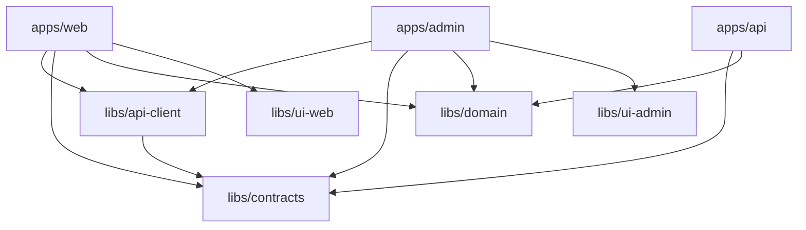

# V2 目标项目结构

## 根目录结构

```text
pmx-platform/
  apps/
    web/                         # 用户前台，Next.js
    admin/                       # 管理后台，Vue 3 + Vite
    api/                         # 后端 API，NestJS

  libs/
    contracts/                   # 三端共享契约
    api-client/                  # Web/Admin 使用的生成式 API client
    domain/                      # 纯业务规则，可选
    ui-web/                      # Web 复用 UI，可选
    ui-admin/                    # Admin 复用 UI，可选

  infra/
    docker/                      # Docker Compose、镜像配置
    ci/                          # CI 配置
    env/                         # 环境变量模板和说明

  docs/
    architecture/
    api/
    operations/
    decisions/

  tools/
    openapi/                     # OpenAPI 导出和 client 生成脚本
    generators/                  # Nx 本地生成器，可选

  nx.json
  package.json
  tsconfig.base.json
```

## 应用项目

| 项目 | 说明 | 部署方式 |
|---|---|---|
| `apps/web` | 用户交易前台 | 独立部署 |
| `apps/admin` | 运营和风控后台 | 独立部署 |
| `apps/api` | 后端 API | 独立部署 |

## 共享库

| 库 | 给谁用 | 内容 |
|---|---|---|
| `libs/contracts` | Web、Admin、API | API 类型、公共枚举、错误码、分页结构、公开状态 |
| `libs/api-client` | Web、Admin | 由 OpenAPI 生成的 typed client |
| `libs/domain` | Web、Admin、API | 纯计算、纯判断、无副作用规则 |
| `libs/ui-web` | Web | 用户前台复用 UI |
| `libs/ui-admin` | Admin | 后台复用 UI |

## 依赖方向



## 禁止依赖

| 禁止项 | 原因 |
|---|---|
| `apps/web` import `apps/api/src/*` | 会破坏前后端分离 |
| `apps/admin` import `apps/api/src/*` | 会破坏后台和 API 边界 |
| `libs/contracts` import Prisma | 会把数据库模型泄漏给前端 |
| `libs/contracts` import React/Vue/Nest | 契约库必须框架无关 |
| `libs/domain` import HTTP/Prisma/SDK | domain 只能放纯规则 |
| `apps/api` import `libs/api-client` | API 不应该调用自己的 client |

## Nx 标签建议

用标签管理依赖边界：

```text
type:app
type:lib
scope:web
scope:admin
scope:api
scope:shared
layer:contract
layer:domain
layer:client
layer:infra
```

规则示例：

| 来源 | 允许依赖 |
|---|---|
| `scope:web` | `scope:shared`、`scope:web` |
| `scope:admin` | `scope:shared`、`scope:admin` |
| `scope:api` | `scope:shared`、`scope:api` |
| `layer:contract` | 不依赖业务 app、不依赖 infra |
| `layer:domain` | 只依赖 `layer:contract` |

## 迁移后的命令形态

```bash
npx nx serve web
npx nx serve admin
npx nx serve api

npx nx build web
npx nx build admin
npx nx build api

npx nx test web
npx nx test admin
npx nx test api

npx nx affected -t build test lint
npx nx graph
```

## 和当前目录的对应关系

| 当前路径 | V2 目标路径 |
|---|---|
| `apps/web` | `apps/web` |
| `apps/admin` | `apps/admin` |
| `apps/api` | `apps/api` |
| `packages/shared` | `libs/contracts` + `libs/domain` |
| `docker-compose.yml` | `infra/docker/docker-compose.yml` 或保留根目录入口 |
| `docs` | `docs` 保留，并按主题整理 |
