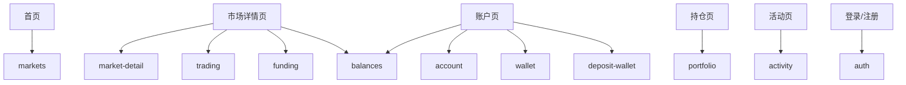

# Web 前台模块拆分

## 目标

`apps/web` 只负责用户交易前台体验。它不处理数据库、不接触 Polymarket SDK、不直接写后端业务规则。

Web 依赖：

- `@pmx/contracts`
- `@pmx/api-client`
- `@pmx/domain`
- Web 自己的 UI 和 hooks

## 目录结构

```text
apps/web/
  src/
    app/
      layout.tsx
      page.tsx
      login/
      register/
      account/
      markets/
      portfolio/
      activity/

    modules/
      auth/
        components/
        hooks/
        auth.store.ts
        auth.actions.ts
      account/
        components/
        hooks/
      markets/
        components/
        hooks/
        market-list.query.ts
      market-detail/
        components/
        hooks/
      wallet/
        components/
        hooks/
        wallet-signing.ts
      deposit-wallet/
        components/
        hooks/
      balances/
        components/
        hooks/
      funding/
        components/
        hooks/
      trading/
        components/
        hooks/
        order-preview.form.ts
      portfolio/
        components/
        hooks/
      activity/
        components/
        hooks/

    flows/
      auth.flow.ts
      market.flow.ts
      wallet.flow.ts
      funding.flow.ts
      trade.flow.ts
      scenarios/
        register-login.flow.ts
        trade-preview.flow.ts
        wallet-funding-readiness.flow.ts

    shared/
      ui/
      hooks/
      config/
      i18n/
      errors/
```

## 模块职责

| 模块 | 负责 | 不负责 |
|---|---|---|
| `auth` | 登录、注册、token 状态 | 用户资料编辑 |
| `account` | 账户页、用户状态 | 钱包签名 |
| `markets` | 市场列表、筛选、搜索 | 市场详情交易表单 |
| `market-detail` | 市场详情、盘口展示 | 订单提交 |
| `wallet` | 用户钱包连接、签名证明 | 余额计算、Deposit Wallet 创建 |
| `deposit-wallet` | 展示/创建 Provider Deposit Wallet | 用户钱包归属证明 |
| `balances` | 余额展示、余额刷新 | Funding 判断 |
| `funding` | 入金准备度、授权提示 | 真实余额查询实现 |
| `trading` | 订单预览、用户确认、签名入口 | Provider SDK 调用 |
| `portfolio` | 持仓展示 | 订单创建 |
| `activity` | 订单、成交、操作记录 | 审计写入 |

## 前端业务流程层

V2 Web 需要在模块 actions 之上增加一层 **Business Flow Layer**，给 UI、测试和 AI 调用同一套业务流程。

目标：

- AI 不通过 Playwright 操作页面，也不依赖 DOM、按钮文案、selector。
- UI 页面只负责展示和收集输入，业务编排放到 actions/flows。
- 流程测试可以直接调用 TypeScript API，把注册、登录、选市场、钱包准备、Funding、订单预览等流程跑完。
- Playwright 只保留少量页面 smoke test，用来确认页面能打开、主要交互没坏。

分层规则：

```text
api-client  -> typed HTTP 请求
actions     -> 单模块业务动作
flows       -> 跨模块完整业务流程
scenarios   -> AI 和测试可直接调用的端到端业务用例
UI          -> 调用 actions/flows，不直接编排复杂流程
```

推荐结构：

```text
modules/auth/auth.actions.ts
modules/markets/markets.actions.ts
modules/wallet/wallet.actions.ts
modules/funding/funding.actions.ts
modules/trading/trading.actions.ts

flows/auth.flow.ts
flows/market.flow.ts
flows/wallet.flow.ts
flows/funding.flow.ts
flows/trade.flow.ts
flows/scenarios/full-trade-preview.flow.ts
```

示例调用：

```text
await flows.auth.registerAndLogin(user)
await flows.markets.pickTradableMarket()
await flows.wallet.bindMockWallet(user)
await flows.wallet.ensureDepositWallet()
await flows.funding.refreshReadiness()
await flows.trade.previewOrder({ marketId, outcomeIndex, amountUsd })
```

边界：

| 层 | 负责 | 不负责 |
|---|---|---|
| `api-client` | HTTP、认证 header、错误结构、base URL | 业务流程编排 |
| `actions` | 单模块动作，例如登录、刷新余额、订单预览 | 跨模块流程 |
| `flows` | 编排多个 actions，形成完整业务路径 | DOM、页面布局、真实 Provider SDK |
| `scenarios` | 测试和 AI 可调用的固定业务用例 | 生产环境危险操作 |
| Playwright | 页面 smoke、布局和真实浏览器交互 | 主业务流程验证 |

涉及外部依赖的流程必须通过 adapter 注入：

```text
WalletSignerAdapter
MarketProviderAdapter
DepositWalletRelayerAdapter
Clock
TestUserFactory
```

这样测试环境可以使用 mock/sandbox，不需要真实钱包、真实资金或真实 CLOB 提交。

## 页面和模块关系



## API 调用规则

Web 只通过 `@pmx/api-client` 调用 API：

```text
modules/markets -> apiClient.markets
modules/wallet -> apiClient.wallets
modules/balances -> apiClient.balances
modules/funding -> apiClient.funding
modules/trading -> apiClient.orders
flows/* -> modules/* actions -> apiClient.*
```

禁止：

- 组件里直接写 `fetch("/api/...")`。
- Web import `apps/api/src/*`。
- Web import Prisma 或 Provider SDK。
- AI 测试通过 Playwright selector 作为主要业务流程入口。
- 页面组件直接串联多个远程请求来完成跨模块流程。

## 状态管理建议

优先少写全局状态：

| 状态 | 建议 |
|---|---|
| auth token/session | 小型 store |
| market list/detail | query cache |
| wallet connection | wallet 模块内部 hook |
| order ticket form | 组件局部状态 |
| balances/funding | query cache + 手动刷新 |

如果后续引入 React Query/TanStack Query，Web 的远程数据状态可以统一交给它，不要手写大量 store。

## 测试边界

| 类型 | 覆盖 |
|---|---|
| 单测 | 表单计算、状态判断、组件交互 |
| 集成测试 | 登录、市场详情、订单预览、钱包准备状态 |
| Flow 测试 | 注册/登录、选市场、钱包绑定、Deposit Wallet、Funding readiness、订单预览 |
| E2E | 页面 smoke、核心导航、账户页渲染、Admin 权限隔离 |

推荐测试入口：

```bash
npm run test:flows
npm run test:flow -- trade-preview-ready
npm run test:flow -- wallet-funding-blocked
```

Flow 测试通过业务 API 直接运行，不依赖浏览器。E2E 只覆盖 UI 是否能正常渲染和交互，不再承担完整业务流程验证。
