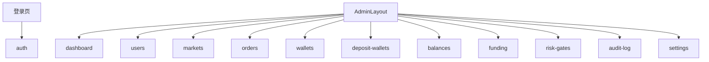

# Admin 后台模块拆分

## 目标

`apps/admin` 只负责运营和风控后台。它不参与用户签名，不控制用户资金，不直接访问数据库。

Admin 依赖：

- `@pmx/contracts`
- `@pmx/api-client`
- `@pmx/domain`
- Admin 自己的 UI、router、stores

## 目录结构

```text
apps/admin/
  src/
    app/
      App.vue
      main.ts
    router/
      index.ts
      guards.ts
    layouts/
      AdminLayout.vue

    modules/
      auth/
        views/
        stores/
      dashboard/
        views/
        components/
      users/
        views/
        components/
      markets/
        views/
        components/
      orders/
        views/
        components/
      wallets/
        views/
        components/
      deposit-wallets/
        views/
        components/
      balances/
        views/
        components/
      funding/
        views/
        components/
      risk-gates/
        views/
        components/
      audit-log/
        views/
        components/
      settings/
        views/
        components/

    shared/
      ui/
      stores/
      config/
      errors/
```

## 模块职责

| 模块 | 负责 | 不负责 |
|---|---|---|
| `auth` | 管理员登录、token、路由守卫 | 用户前台登录 |
| `dashboard` | 指标概览、风险摘要 | 明细操作 |
| `users` | 用户列表、角色、状态 | 修改用户钱包资产 |
| `markets` | 市场同步状态、Provider 状态 | 真实下单 |
| `orders` | 订单列表、订单详情、状态追踪 | 代替用户签名 |
| `wallets` | 用户钱包地址和验证状态 | 查询余额 |
| `deposit-wallets` | Deposit Wallet 创建/状态审查 | 用户私钥或签名 |
| `balances` | 余额快照只读展示 | 资产划转 |
| `funding` | 入金、授权、交易准备度 | 直接修改链上授权 |
| `risk-gates` | 人工 Gate、风控状态 | 绕过合规限制 |
| `audit-log` | 审计日志查询 | 写业务日志 |
| `settings` | 后台配置查看 | 线上密钥编辑 |

## 页面关系



## API 调用规则

Admin 只通过 `@pmx/api-client` 调用 API：

```text
modules/users -> apiClient.admin.users
modules/orders -> apiClient.admin.orders
modules/wallets -> apiClient.admin.wallets
modules/balances -> apiClient.admin.balances
modules/risk-gates -> apiClient.admin.riskGates
```

禁止：

- Admin 直接读写数据库。
- Admin import API 内部 service。
- Admin 出现用户私钥、签名原文、交易代签逻辑。
- Admin 直接操作 Provider SDK。

## 权限边界

| 权限 | 能做 |
|---|---|
| `ADMIN` | 查看用户、订单、钱包、余额快照、风险状态 |
| `RISK_OPERATOR` | 查看和处理人工 Gate |
| `READONLY_ADMIN` | 只读查看后台数据 |

V2 不建议把复杂 RBAC 一次做完。先保留角色枚举和路由守卫，后台 API 再逐步加细粒度权限。

## UI 组织

优先使用成熟组件库：

- Ant Design Vue 负责表格、表单、弹窗、筛选器。
- 自己只封装后台常用组合组件，如 `DataTableShell`、`StatusTag`、`RiskGateBadge`。
- 不复制大型后台模板框架的整套工程，避免后续升级困难。

## 测试边界

| 类型 | 覆盖 |
|---|---|
| 单测 | stores、路由守卫、状态转换 |
| 组件测试 | 表格筛选、状态标签、权限展示 |
| E2E | 普通用户不能进 Admin、管理员能看用户列表 |
