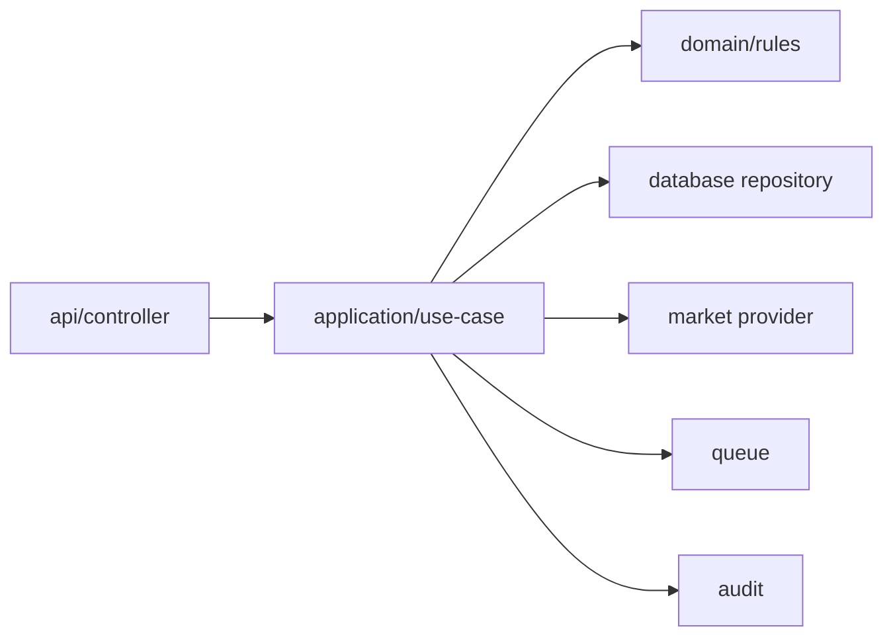

# API 后端模块拆分

## 目标

`apps/api` 是唯一可以访问数据库、队列、Provider SDK、外部市场接口的项目。

后端要做到：

- Controller 只处理 HTTP 输入输出。
- Application Service 编排业务流程。
- Domain 放纯规则和状态机。
- 数据库访问走 database bridge。
- 外部市场访问走 Provider adapter。
- 审计、风控、队列不散落在各个 service 里。

## 目录结构

```text
apps/api/
  src/
    bootstrap/
      main.ts
      app.module.ts
      validation.pipe.ts
      openapi.ts

    modules/
      auth/
        api/
        application/
        domain/
        mappers/
      users/
        api/
        application/
        domain/
        mappers/
      markets/
        api/
        application/
        domain/
        mappers/
      wallets/
        api/
        application/
        domain/
        mappers/
      deposit-wallets/
        api/
        application/
        domain/
        mappers/
      balances/
        api/
        application/
        domain/
        mappers/
      funding/
        api/
        application/
        domain/
        mappers/
      orders/
        api/
        application/
        domain/
        mappers/
      admin/
        api/
        application/
      compliance/
        application/
        domain/
      audit/
        application/
        domain/

    infrastructure/
      database/
      market-providers/
      queue/
      cache/
      config/
      logger/
      clock/
```

## 模块职责

| 模块 | 负责 | 不负责 |
|---|---|---|
| `auth` | 注册、登录、token、密码 | 用户资料业务 |
| `users` | 用户资料、角色、状态 | 管理后台聚合查询 |
| `markets` | 市场列表、详情、快照同步 | 下单 |
| `wallets` | 用户钱包绑定、地址归属证明 | 余额、入金 |
| `deposit-wallets` | Provider Deposit Wallet 查询/创建/状态 | 用户钱包签名 |
| `balances` | 余额快照、余额查询、余额缓存 | 钱包绑定 |
| `funding` | 入金准备度、余额和授权检查 | 订单创建 |
| `orders` | 订单预览、签名校验、提交、状态 | 余额底层查询 |
| `admin` | 后台聚合接口 | 核心业务规则 |
| `compliance` | geoblock、风险限制、人工 Gate | UI 展示 |
| `audit` | 审计日志写入和查询 | 业务决策 |

## 后端内部调用关系



## 单个模块内部结构示例

```text
modules/orders/
  api/
    orders.controller.ts
    orders.admin.controller.ts
  application/
    preview-order.use-case.ts
    submit-signed-order.use-case.ts
    get-order-status.use-case.ts
  domain/
    order-state.ts
    order-risk.ts
    order-signature-policy.ts
  mappers/
    order-contract.mapper.ts
  orders.module.ts
```

## Controller 规则

Controller 可以做：

- 接收请求。
- 调用 use case。
- 返回 contract DTO。

Controller 不做：

- Prisma 查询。
- Polymarket SDK 调用。
- 复杂业务判断。
- 手写审计逻辑。

## Application 规则

Application Service 可以做：

- 编排 Repository、Provider、Audit、Queue。
- 处理事务边界。
- 调用 domain 规则。
- 把内部结果映射为 contract DTO。

Application Service 不做：

- 存放底层 SQL/Prisma 查询细节。
- 存放 Polymarket 原始 payload 映射细节。
- 直接返回数据库模型。

## Domain 规则

Domain 只能放纯规则：

```text
canSubmitOrder(order, fundingReadiness, complianceStatus)
calculateMaxSpend(balance, price, shares)
isWalletReady(wallet, depositWallet, funding)
```

Domain 不依赖：

- NestJS
- Prisma
- Redis
- HTTP
- Polymarket SDK

## 后端模块依赖规则

| 来源 | 允许依赖 |
|---|---|
| `modules/orders` | `funding` application、`markets` application、database bridge、provider |
| `modules/funding` | `wallets`、`deposit-wallets`、`balances` |
| `modules/balances` | database bridge、provider |
| `modules/admin` | 各模块 read use case，不直接写核心数据 |
| `modules/audit` | database bridge |
| `modules/compliance` | database bridge、domain rules |

## 生成 OpenAPI

API 项目负责导出 OpenAPI：

```bash
npx nx run api:openapi
```

输出：

```text
tools/openapi/openapi.json
libs/api-client/src/generated/schema.ts
```

这个文件是 Web/Admin 类型和 client 的来源。
