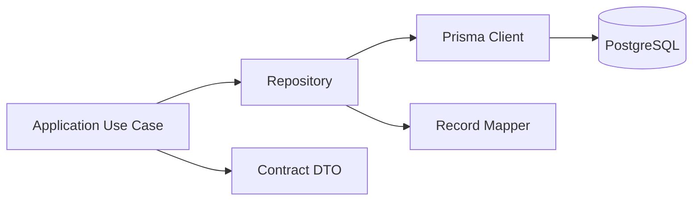

# 数据库桥接层

## 目标

数据库桥接层是后端内部基础设施，只允许 `apps/api` 使用。

它解决的问题：

- Prisma 查询不要散落在各个业务 service 里。
- 数据库模型不要直接暴露给 API contracts。
- 复杂事务集中管理。
- 后续换表结构时，影响范围可控。

## 目录结构

```text
apps/api/src/infrastructure/database/
  prisma/
    prisma.module.ts
    prisma.service.ts

  repositories/
    user.repository.ts
    market.repository.ts
    wallet.repository.ts
    deposit-wallet.repository.ts
    balance.repository.ts
    funding.repository.ts
    order.repository.ts
    audit-log.repository.ts

  mappers/
    user-record.mapper.ts
    market-record.mapper.ts
    wallet-record.mapper.ts
    balance-record.mapper.ts
    order-record.mapper.ts

  transactions/
    transaction-manager.ts

  database.module.ts
```

## 调用关系



## Repository 职责

Repository 负责：

- Prisma 查询。
- 数据库记录到内部模型的转换。
- 常用查询方法封装。
- 事务上下文接入。

Repository 不负责：

- HTTP DTO。
- 风险判断。
- Provider SDK 调用。
- UI 展示模型。

## Mapper 职责

Mapper 负责：

- Prisma record -> internal model。
- internal model -> persistence input。
- 隐藏数据库字段差异。

Mapper 不负责：

- API response DTO。
- 前端展示文案。
- 业务流程编排。

## Transaction 职责

需要事务的场景：

- 提交订单时同时写订单、审计、状态变更。
- 创建 Deposit Wallet 时同时写 wallet 状态和 audit log。
- 更新 funding readiness 时同时写余额快照和 readiness。

示例关系：

```text
SubmitSignedOrderUseCase
  transactionManager.run()
    orderRepository.create()
    auditLogRepository.create()
    orderRepository.updateProviderStatus()
```

## 数据库模型和 API 模型隔离

数据库可以保存内部字段：

```text
Order
  id
  userId
  provider
  externalOrderId
  rawProviderPayload
  signatureDigest
  createdAt
```

API 返回给前端：

```text
OrderDetail
  id
  provider
  status
  marketTitle
  side
  price
  shares
  createdAt
```

`rawProviderPayload`、`signatureDigest` 不进入前端 contract。

## 不要过度封装

不建议给每个简单表都写大量 CRUD 方法。

优先封装这些高价值区域：

| Repository | 原因 |
|---|---|
| `order.repository` | 订单状态复杂，涉及交易和审计 |
| `wallet.repository` | 钱包归属和安全边界重要 |
| `deposit-wallet.repository` | Provider 状态和本地状态要隔离 |
| `balance.repository` | 余额快照需要来源和时间 |
| `funding.repository` | 交易准备度会被多个模块读取 |
| `audit-log.repository` | 所有关键操作需要统一留痕 |

简单只读查询可以先留在对应 repository，不额外抽象 query bus。

## 数据库桥接层禁止项

- 不 import React/Vue。
- 不 import `libs/api-client`。
- 不返回 Prisma record 给 Controller。
- 不保存用户私钥。
- 不把外部 Provider raw payload 当成业务主模型。
