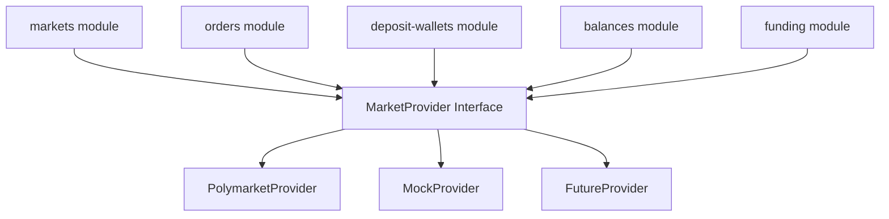

# Market Provider 适配层

## 目标

Polymarket 只是当前 Provider，不应该成为核心业务模型。

V2 要把外部市场和交易平台封装成统一 Provider 接口：

```text
modules/orders
modules/markets
modules/balances
modules/funding
  -> MarketProvider
    -> PolymarketProvider
    -> MockProvider
    -> FutureProvider
```

## 目录结构

```text
apps/api/src/infrastructure/market-providers/
  provider.types.ts
  provider.registry.ts
  market-provider.module.ts

  polymarket/
    polymarket.provider.ts
    polymarket-gamma.client.ts
    polymarket-clob.client.ts
    polymarket-relayer.client.ts
    polymarket.mapper.ts
    polymarket.config.ts

  mock/
    mock-market.provider.ts

  future/
    future-market.provider.ts
```

## Provider 接口能力

先按当前真实需要定义，不做大而全 SDK。

```text
MarketProvider
  providerId
  listMarkets()
  getMarket()
  getOrderBook()
  getDepositWallet()
  createDepositWallet()
  getBalances()
  getFundingReadiness()
  previewOrder()
  submitSignedOrder()
  cancelOrder()
  getOrderStatus()
  getPositions()
```

## Provider 关系图



## Polymarket 内部拆分

| 文件 | 负责 |
|---|---|
| `polymarket.provider.ts` | 实现统一 Provider 接口 |
| `polymarket-gamma.client.ts` | Gamma API 市场数据 |
| `polymarket-clob.client.ts` | CLOB 订单簿、订单状态、下单 |
| `polymarket-relayer.client.ts` | Deposit Wallet、Relayer 能力 |
| `polymarket.mapper.ts` | Polymarket raw payload -> 内部模型 |
| `polymarket.config.ts` | host、chainId、builderCode、开关 |

## Provider 不能泄漏 raw payload

Polymarket 返回的原始字段只在 adapter 内部出现：

```text
PolymarketGammaMarketRaw
  -> polymarket.mapper.ts
  -> ProviderMarket
  -> modules/markets
  -> MarketDetail contract
```

业务模块只能看到统一模型：

```text
ProviderMarket
  provider
  externalMarketId
  title
  status
  outcomes
  orderBook
```

## 数据库预留字段

市场：

```text
Market
  id
  provider
  externalMarketId
  title
  status
  rawProviderPayload?
```

订单：

```text
Order
  id
  provider
  externalOrderId
  externalMarketId
  status
  rawProviderPayload?
```

余额：

```text
BalanceSnapshot
  id
  provider
  walletAddress
  assetSymbol
  availableAmount
  lockedAmount
  source
  checkedAt
```

`rawProviderPayload` 只用于排查和同步，不作为业务判断主来源。

## Provider 选择

通过配置选择：

```text
MARKET_PROVIDER=polymarket
ORDER_ROUTER_MODE=preview
```

本地和测试可以用：

```text
MARKET_PROVIDER=mock
```

## 换 Provider 的影响范围

如果以后不接 Polymarket，只接新平台，应该只改：

- `infrastructure/market-providers/future/*`
- provider config
- 少量 mapper
- 可能新增 migrations 保存外部 ID

不应该改：

- Web 页面业务结构
- Admin 页面业务结构
- orders 核心 use case
- wallets 核心 use case
- contracts 大部分 DTO
