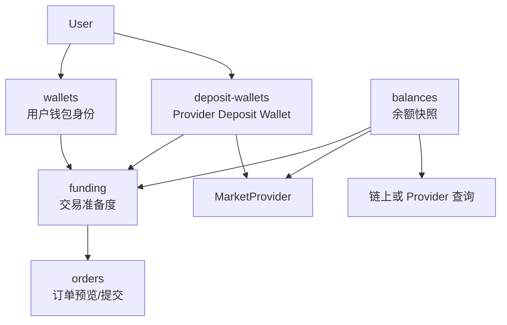

# 钱包、余额、Deposit Wallet、Funding 拆分

## 核心结论

钱包和余额必须是两个独立模块。

原因：

- 钱包是身份、地址、签名能力。
- 余额是资产状态、可用额度、锁定额度。
- Deposit Wallet 是 Provider 侧资金入口。
- Funding 是交易准备度判断。

它们有关联，但不能混在一个 service 里。

## 模块关系



## API 模块

```text
apps/api/src/modules/
  wallets/
  deposit-wallets/
  balances/
  funding/
```

## Web 模块

```text
apps/web/src/modules/
  wallet/
  deposit-wallet/
  balances/
  funding/
```

## Admin 模块

```text
apps/admin/src/modules/
  wallets/
  deposit-wallets/
  balances/
  funding/
```

## 模块职责

| 模块 | 负责 | 不负责 |
|---|---|---|
| `wallets` | 用户钱包地址、链 ID、签名证明、归属验证 | 余额、入金、Provider Deposit Wallet |
| `deposit-wallets` | Provider 分配的钱包、创建/查询、状态同步 | 用户签名证明、余额计算 |
| `balances` | 余额查询、余额快照、可用/锁定金额 | 钱包绑定、订单提交 |
| `funding` | 判断是否具备交易准备度 | 直接下单、直接改余额 |
| `orders` | 读取 funding 结果，做订单预览/提交 | 自己查余额、自己判断授权细节 |

## 数据模型建议

用户钱包：

```text
UserWallet
  id
  userId
  address
  chainId
  verifiedAt
  proofMessage
  proofSignature
  createdAt
```

Deposit Wallet：

```text
DepositWallet
  id
  userId
  provider
  address
  externalWalletId
  status
  createdAt
  updatedAt
```

余额快照：

```text
BalanceSnapshot
  id
  userId
  provider
  walletType
  walletAddress
  assetSymbol
  availableAmount
  lockedAmount
  source
  checkedAt
```

Funding readiness：

```text
FundingReadiness
  id
  userId
  provider
  depositWalletId
  hasDepositWallet
  hasRequiredBalance
  hasRequiredAllowance
  status
  checkedAt
```

## 状态建议

钱包状态：

```text
WalletStatus
  unverified
  verified
  revoked
```

Deposit Wallet 状态：

```text
DepositWalletStatus
  missing
  creating
  active
  failed
```

余额来源：

```text
BalanceSource
  provider
  chain
  cache
```

Funding 状态：

```text
FundingReadinessStatus
  not_ready
  needs_wallet
  needs_deposit_wallet
  needs_balance
  needs_allowance
  ready
  blocked
```

## API 边界

| API | 说明 |
|---|---|
| `GET /wallets/me` | 当前用户钱包 |
| `POST /wallets/verify` | 签名验证钱包归属 |
| `GET /deposit-wallets/me` | 当前用户 Deposit Wallet |
| `POST /deposit-wallets` | 创建或查询 Deposit Wallet |
| `GET /balances/me` | 当前用户余额快照 |
| `POST /balances/refresh` | 刷新余额 |
| `GET /funding/readiness` | 当前用户交易准备度 |

订单模块只读取：

```text
funding.readiness
balances snapshot
wallet verification status
deposit wallet status
```

不自己创建钱包，不自己查链上余额。
