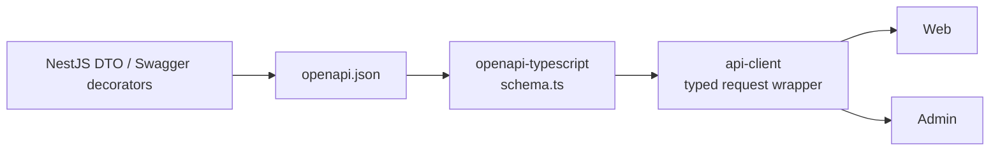

# 开源工具组织方案

## 目标

V2 的原则是：能用成熟开源工具解决的，不写自研框架代码。

保留当前主框架：

- Web：Next.js + React
- Admin：Vue 3 + Vite + Ant Design Vue
- API：NestJS
- DB：Prisma + PostgreSQL
- Queue：BullMQ + Redis

新增或强化工程工具：

- Nx
- NestJS Swagger/OpenAPI
- openapi-typescript
- openapi-fetch 或生成式 client

## 工具选择

| 场景 | 推荐工具 | 用途 |
|---|---|---|
| 多项目组织 | Nx | 项目图、任务缓存、依赖边界、affected 构建 |
| API 文档 | NestJS Swagger/OpenAPI | 从后端 DTO 导出 OpenAPI |
| TypeScript 类型 | openapi-typescript | 从 OpenAPI 生成前端类型 |
| API client | openapi-fetch 或轻量生成 wrapper | 减少手写接口请求 |
| 数据库 | Prisma | schema、migration、client |
| 队列 | BullMQ | 市场、余额、订单状态异步同步 |
| Web 单测 | Vitest | 前端单测 |
| API 单测 | Jest | NestJS 单测 |
| E2E | Playwright | 三端主流程验证 |

## Nx 用法

Nx 负责：

- 项目图。
- 构建缓存。
- 只跑受影响项目。
- 限制模块依赖。
- 统一执行 build/test/lint。

推荐命令：

```bash
npx nx graph
npx nx affected -t build test lint
npx nx run web:serve
npx nx run admin:serve
npx nx run api:serve
```

## OpenAPI 生成链路



## 少写代码的具体规则

| 需求 | 不建议 | 建议 |
|---|---|---|
| API 类型同步 | 手写三份类型 | OpenAPI 生成 |
| API 请求 | 每个页面手写 fetch | 统一 api-client |
| 后台表格 | 自己写复杂表格 | Ant Design Vue Table |
| 表单校验 | 页面里散写 if | 表单库/组件规则 + API DTO 校验 |
| 项目依赖图 | 手工文档维护 | Nx graph |
| 只跑改动测试 | 手写脚本 | Nx affected |
| Provider mock | 到处写假数据 | `MockProvider` |

## 不建议引入的复杂度

V2 暂不建议：

- 微前端。
- Module Federation。
- 自研权限 DSL。
- 自研 ORM。
- 自研 HTTP client 生成器。
- 完整复制大型后台模板工程。
- 一次性把所有 DTO 迁移到 Zod runtime schema。

## 官方参考

- Nx 文档：https://nx.dev/docs/getting-started/intro
- NestJS OpenAPI 文档：https://docs.nestjs.com/openapi/introduction
- openapi-typescript 文档：https://openapi-ts.dev/introduction
- Turborepo 文档：https://turborepo.dev/docs

## 推荐结论

使用 Nx，而不是只用 npm workspaces 或 Turborepo。

原因：

- PMX 有 Web、Admin、API、contracts、api-client、domain 多个项目。
- 需要依赖边界约束，不只是任务缓存。
- 后续模块多，项目图很有价值。
- Nx 支持当前使用的 Next.js、Vite、Nest、Vitest、Jest、Playwright 生态。
